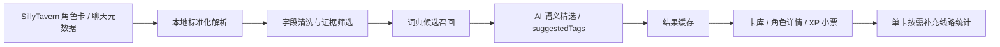

# CharaLog

CharaLog 是一个面向 SillyTavern 用户的本地扩展，用来把角色卡库和基础游玩记录整理成可读的“角色口味画像”。

它不会把完整聊天正文默认上传给 AI，而是优先在本地完成角色卡解析、标签候选召回、使用记录统计和结果缓存；需要模型判断的部分，再通过用户自己的 SillyTavern / OpenAI-compatible API 生成标签、一句话总结和 XP 小票文案。

## 项目动机

SillyTavern 用户的角色卡库通常很大，角色卡结构也很不统一：有的卡把设定写在 `description`，有的放在 `character_book`，有的把线路菜单写成 HTML、默认开场白或正则提示。用户自己也未必能说清楚“我到底反复在玩什么类型的角色”，但行为数据里其实有很多信号：

- 收藏了哪些角色卡；
- 哪些卡真正聊过；
- 哪些线路被反复打开；
- 用户更常回到哪类关系、身份、题材或互动模式；
- 哪些卡只是收集了但吃灰。

CharaLog 想做的是一个本地优先的 RP 口味分析工具：既能帮用户看见自己的偏好，也能作为角色扮演场景下“用户偏好建模 / 标签体系 / badcase 归因”的产品实验。

## 当前功能

### 卡库读取

- 自动从 SillyTavern 读取角色卡列表和基础聊天记录元数据。
- 默认只读取轻量信息，不在进入页面时扫描完整聊天正文，减少大卡库卡死。
- 卡库首页区分已分析与待分析卡片，支持按当前卡库状态刷新。

### 角色卡分析

- 将不同格式的角色卡统一整理为标准结构。
- 从 `description`、`personality`、`scenario`、`character_book`、`first_mes`、`alternate_greetings` 等字段中筛选和压缩关键信息。
- 结合本地词典召回和 AI 语义判断，输出：
  - 精选标签；
  - 一句话角色总结；
  - 模型提出的 `suggestedTags`；
  - 分析失败原因与可读提示。

### 线路识别

- 默认导入阶段不读取完整聊天正文，只保留聊天数量和是否需要补充统计。
- 在角色详情页可以手动点击“补充线路统计”。
- 补充时只针对当前角色读取聊天记录，并使用首条角色消息匹配对应开场线路。
- 对多线路卡，会优先使用默认开场白里的线路菜单摘要；没有摘要的线路再显示必要的开场信息。

### XP 小票

- 基于已分析卡片做统计，再让 AI 只基于统计摘要生成小票文案。
- 统计内容包括：
  - 高频标签；
  - 代表角色；
  - 暂时没怎么出现的安全大类标签；
  - 本地预览文案；
  - AI 生成的“说破”版本。
- 不读取完整聊天正文，也不做心理诊断式结论。

### 隐私与性能

- 默认不上传完整聊天正文。
- 大部分预处理、统计和缓存都在本地完成。
- 批量分析失败时会停止并展示原因，避免连续浪费 API 调用。
- 针对本地缓存容量、长卡 token 预算、批处理分组等问题做了保护。

## 技术方案



### 核心模块

- `src/integrations/sillyTavern.ts`：SillyTavern 数据读取与扩展桥接。
- `src/core/cardAnalysisInput.ts` / `src/core/analyzeCardBatch.ts`：角色卡分析输入构建、批量分析和结果校验。
- `src/core/cardDigest.ts`：角色卡字段清洗、证据筛选和 token 预算控制。
- `src/core/dictionary.ts` / `src/core/recallCandidateTags.ts`：本地标签词典、候选召回和别名归一。
- `src/core/tasteProfile.ts`：XP 小票统计、代表角色和偏好摘要。
- `src/App.tsx`：扩展主界面。
- `sillytavern-extension/charalog/`：可安装到 SillyTavern 的扩展产物。

## 关键设计

### 1. 本地词典不是最终答案

早期版本过度依赖词典，容易把“背景设定”“NPC 描述”“世界书关键词”误当成角色标签。现在的策略是：

- 词典负责召回候选；
- AI 负责从候选里精选；
- AI 也可以提出词典外 `suggestedTags`；
- 词典权重降低，避免机械匹配压过语义判断。

这让系统既不会完全失控地自由生成标签，也不会被词典绑死。

### 2. 只把任务相关内容送给 AI

角色卡里常常混有装饰 HTML、音乐链接、作者说明、线路菜单、世界书开关、NPC 设定和大量背景细节。CharaLog 会先做本地筛选，把更可能影响标签和总结的内容整理出来，例如：

- 角色身份；
- 角色性格；
- 与 `{{user}}` 的关系；
- 当前玩法冲突；
- 线路菜单中的短描述；
- 对用户选择有意义的设定。

住所、长篇世界观、无关 NPC、纯 UI 文案会被降权或剔除。

### 3. 快速导入和精细统计分开

完整读取所有聊天记录会非常慢，也容易让 SillyTavern 弹出“没有响应”。因此当前版本采用两层策略：

- 进入扩展时，只读角色卡和聊天列表元数据；
- 需要具体线路统计时，用户在单张角色详情页手动补充。

这样首页能更快可用，重操作也只发生在用户真的需要的角色上。

### 4. badcase 驱动迭代

项目迭代过程中重点处理过这些问题：

| 问题 | 处理方式 |
| --- | --- |
| NPC 性格被识别成主角性格 | 增加证据来源和字段优先级，强化主角 / `{{user}}` 关系判断 |
| 默认开场白里有线路菜单但格式不统一 | 兼容编号、标题、HTML、短句菜单和部分自定义说明 |
| 长卡 token 过高 | 先本地蒸馏证据，再构建 AI 输入 |
| 词典别名冲突 | 对 alias 做归一和去重，降低硬匹配权重 |
| 批量分析连续失败浪费 API | 失败后停止批处理并展示原因 |
| 大聊天库导入卡死 | 默认不读完整聊天，改为单卡按需补充 |

## 开发与运行

```bash
pnpm install
pnpm dev
```

构建 SillyTavern 扩展：

```bash
pnpm build:st-extension
```

构建后的扩展目录位于：

```text
sillytavern-extension/charalog/
```

将该目录复制到 SillyTavern 的第三方扩展目录即可本地使用：

```text
SillyTavern/public/scripts/extensions/third-party/charalog
```

## 测试

```bash
pnpm test
pnpm build
```

当前项目包含核心领域逻辑测试，重点覆盖标签分析、角色卡证据筛选、使用记录统计和 XP 小票聚合逻辑。

## 项目价值

CharaLog 不只是一个“好玩的小票页面”，它实际在尝试解决角色扮演产品里的几个核心问题：

- 如何从非结构化角色卡里提取可评估的角色特征；
- 如何把用户的游玩行为转化成偏好信号；
- 如何在隐私敏感场景里控制 AI 输入范围；
- 如何用 badcase 反推标签体系和模型提示词设计；
- 如何让模型输出既有解释力，又不把用户审判成心理画像。

这也是我把它作为作品集项目的原因：它同时包含用户洞察、模型策略、数据清洗、前端交互、SillyTavern 扩展接入和持续 badcase 迭代。

## 当前限制

- 标签质量仍受当前模型能力和提示词稳定性影响。
- 线路统计需要用户在单卡详情页手动补充，不会默认扫描全部聊天正文。
- 不同角色卡作者写法差异很大，极端格式仍可能需要继续补规则。
- XP 小票是娱乐化总结，不代表严格心理分析。

## License

MIT
